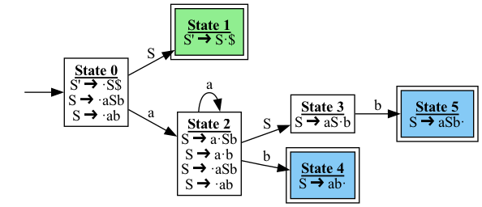

# yacv: Yet Another Compiler Visualizer

> 基于 Github 项目 [yacv](https://github.com/ashutoshbsathe/yacv) 修改，修复了大量 bug，添加许多功能

`yacv` 是一个用于可视化 LL(1) 和 LR 解析器 (LR0/SLR1/LR1/LALR1) 的工具。

## 介绍

学习解析技术可能会很困难。虽然著名的 ["龙书"](https://suif.stanford.edu/dragonbook/) 是关于编译器的极好资源，但它对解析过程本身的可视化内容非常少。尽管如此，仍然存在一些可视化工具，例如 Zak Kincaid 和 Shaowei Zhu 的 [LR(0) parser visualizer](https://www.cs.princeton.edu/courses/archive/spring20/cos320/LR0/) 和 [LL(1) parser visualizer](https://www.cs.princeton.edu/courses/archive/spring20/cos320/LL1/)，[JSMachines](http://jsmachines.sourceforge.net/machines/lr1.html)，[Jison](https://zaa.ch/jison/try/usf/) 等。然而，所有这些工具都是基于网页的，并且大多数都在表格中显示步骤，这并不是很直观。

`yacv` 试图通过使用 [`manim`](https://github.com/3b1b/manim) 来克服所有这些缺点。

## 主要功能

`yacv` 接受上下文无关文法和字符串，并可以用于：

1. 可视化语法树
2. 可视化 LR DFA
3. 导出 LL(1)、LR(LR0/SLR1/LR1/LALR1) 语法分析表
4. 使用 [manim](https://github.com/3b1b/manim) 逐步可视化预测分析过程

## 安装

依赖:

1. `Python` 3.6+
2. `pygraphviz`
3. `pandas`
4. `manim` : `yacv` 理论上 _应该_ 可以与两个 `manim` 版本（[ManimGL](https://github.com/3b1b/manim) 或 [ManimCE](https://docs.manim.community/en/v0.4.0/installation.html#installing-manim)）一起工作，但推荐使用 ManimCE

`pycairo` 相关问题 ? 查看 [this](https://github.com/pygobject/pycairo/issues/148#issuecomment-770024652)

要安装 `yacv`，请将 [`yacv` GitHub 仓库](https://github.com/ashutoshbsathe/yacv) 克隆到本地机器，然后使用 `pip 进行安装

```bash
git clone https://github.com/ 
cd yacv 
pip install -e .
pip install colour pyyaml manimgl
```

如果遇到 `pygraphviz` 安装报错，可以尝试以下命令后再安装

```bash
python3 -m pip install -U --no-cache-dir  \
            --config-settings="--global-option=build_ext" \
            --config-settings="--global-option=-I$(brew --prefix graphviz)/include/" \
            --config-settings="--global-option=-L$(brew --prefix graphviz)/lib/" \
            pygraphviz
```

请查看 [docs](https://ashutoshbsathe.github.io/yacv/getting-started/#notes-for-ubuntu-wsl) 中关于在 Ubuntu WSL 上安装的额外说明

## 使用方法

使用示例配置 [`example_config.yml`](example_config.yml) 运行 `yacv`

```bash
yacv example_config.yml 
```

要使用您自己的文法和字符串，请创建您自己的自定义配置并使用它。各种文法的配置文件示例可以在 [examples/](examples) 目录中找到。

## Demo

运行上述示例配置后，将生成以下内容：

### [语法树](demo/abstractsyntaxtree.pdf)


### DFA



### [语法分析表](demo/lr0-parsing-table.csv)


### 可视化分析过程

[[Parsing Process](demo/ManimParsingVisualization.mp4)](https://github.com/user-attachments/assets/f71b6035-a641-42c0-9f43-d03047393dfd)

## 已知问题

- 暂不支持 ‘，只能使用单个字母作为终结符和非终结符

## 文档

有关更多信息，请参阅 [文档](https://ashutoshbsathe.github.io/yacv)

## 许可证

MIT

## 阅读材料

1. [A good, free book for interpreters](http://craftinginterpreters.com/)
2. [GCC does not use machine generated parsers](https://stackoverflow.com/questions/6319086/are-gcc-and-clang-parsers-really-handwritten)
3. [Why LL and LR parsing is hard ?](https://blog.reverberate.org/2013/09/ll-and-lr-in-context-why-parsing-tools.html)

原作者还写了一篇关于如何构建这个项目的博客。请查看[这里](https://ashutoshbsathe.github.io/blog/2021/parsing-the-parser/)
